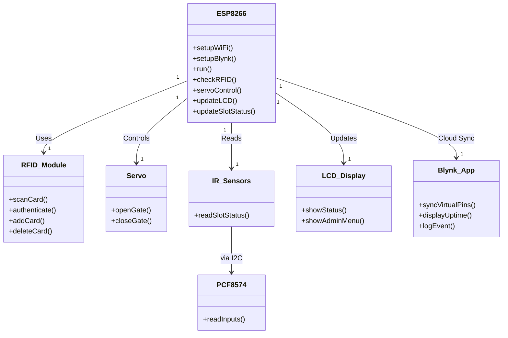
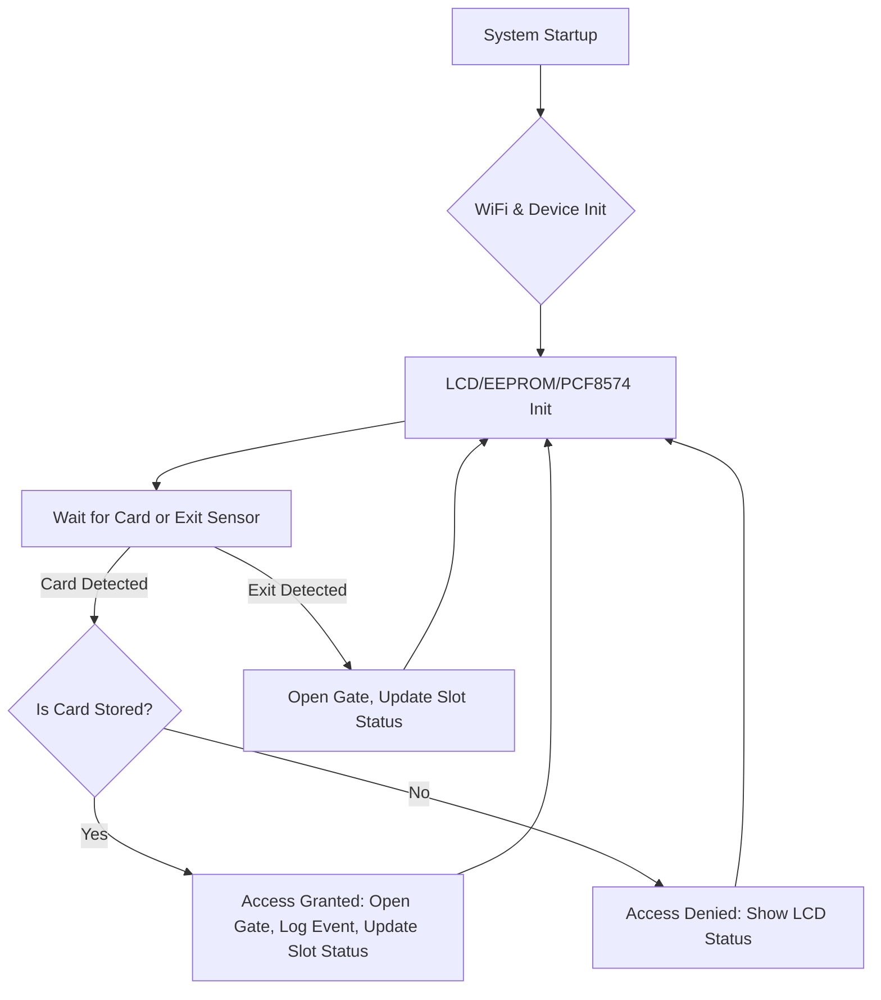
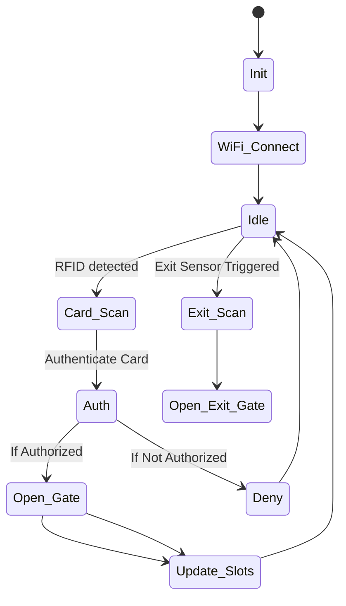

# IoT RFID Smart Parking & Slot Management System

---

## Abstract
  
This project implements a secure, automated smart parking solution using ESP8266, RFID cards, servo gates, LCD display, Blynk IoT connectivity, and IR sensor-based slot detection. The system manages up to four slots and uses EEPROM to persistently store authorized cards for entry. Each vehicle scans its RFID card at the gate; only permitted cards allow the servo-controlled barrier to open, with audit logs and access events recorded in the Blynk cloud. IR sensors detect real-time occupancy and update available slots on both the local LCD and the remote app. Administrators can add or delete authorized cards via Blynk, monitor uptime and slot status, and perform manual overrides if needed. The modular architecture supports easy expansion to more slots and additional sensors, making it scalable for deployments in residential complexes, public parking lots, or institutional campuses. This system enhances parking security, increases automation, lowers labor dependency, and enables detailed data analytics for facility managers.

---

## Hardware Components
  
- ESP8266 (WiFi main controller)
- MFRC522 RFID Reader
- PCF8574 I/O Expander (I2C)
- IR Sensors (x4, for slot detection)
- Servo Motor (gate control)
- 20x4 I2C LCD Display
- LEDs & wiring/breadboard
- Power supply

---

## Software Structure
  
- `main.ino`: RFID, slot management, servo, LCD, Blynk logic
- Built-in support for: BlynkSimpleEsp8266, MFRC522, PCF8574, LiquidCrystal_I2C

---

## Key Features
  
- RFID authentication for entry/exit
- Real-time IR-based slot status updating
- Servo gate automation
- LCD and cloud-based feedback
- Card management (add/delete via serial/Blynk)
- EEPROM for persistent card storage

---

## UML Class Diagram
  

---

## Flowchart
  

---

## State Diagram
  

---

## File Descriptions
  
| File/Folder     | Content/Function                                |
|-----------------|-------------------------------------------------|
| main.ino        | Main firmware code                              |
| Schematic      | Schematic               |

---

## License
  
MIT License

---
